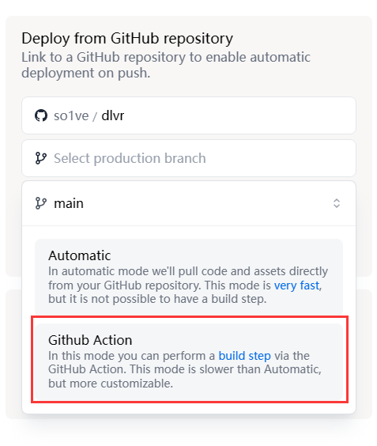

# Getting Started

## Deploy

### Deploy to Deno Deploy (Recommended)

First, fork this repository.

Then, go to [Deno Deploy](https://dash.deno.com/projects) and create a new project.

Add an actions secret named `DENO_DEPLOY_PROJECT_NAME` and set the value to your project name.

Select your forked repository, and set the deploy method to `GitHub Actions`.

Finally, click `Deploy` to deploy your project.

You are done!

### Other deployment...

Please refer to [Nitro Docs](https://nitro.unjs.io/deploy) for more information.
